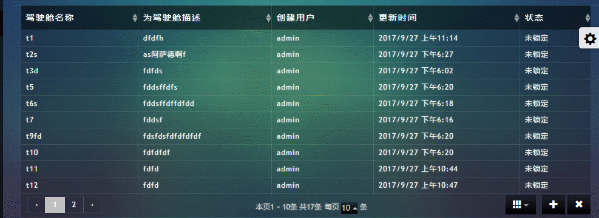

# bootstrap-table插件实现增删改功能

cockm2.html效果如下：



核心代码：
```
   $(function(){
        var field = ["name","descrption"],
                titleText = ["驾驶舱名称","驾驶舱描述"];
        $("#table6").bootstrapTable({
            toggle:"table",
            url:"/monitor/getMonitorViewList.do",
            toolbar:"#btnAddRemove",
            pagination:true,
            showColumns:true,
            columns:[
                {
                    field:"name",
                    title:"驾驶舱名称",
                    sortable:true
                },{
                    field:"descrption",
                    title:"为驾驶舱描述",
                    sortable:true
                },{
                    field:"userName",
                    title:"创建用户",
                    sortable:true
                },{
                    field:"updateTime",
                    title:"更新时间",
                    formatter:function(value,row,index){
                        return getLocalTime(value);
                    },
                    sortable:true
                },{
                    field:"lockStatus",
                    title:"状态",
                    formatter:function(value,row,index){
                        if(value){
                            return "锁定";
                        }else {
                            return "未锁定";
                        }
                    },
                    sortable:true
                }
            ],
            onClickRow:function(e,row){
                $(".tabRowClickbg").removeClass("tabRowClickbg");
                $(row).addClass("tabRowClickbg");
            },
            onDblClickRow:function(dataRow,row){
                var rowKeyArry = Object.keys(dataRow);
                rowKeyArry.forEach(function(item,index){
                   if(dataRow[item]==$(row.context).text()){
                       if(item=="descrption"||item=="name"){
                           if(!$(row.context).children().hasClass("rowCellInput")){
                               var input = $('<input type="text" class="rowCellInput" value="'+$(row.context).text()+'"/>')
                                       .width($(row.context).width())
                                       .height($(row.context).outerHeight(true)).css("background","none");
                               $(row.context).html(input);
                               $(row.context).children(input).focus().blur(function(){
                                   var cText = $.trim($(this).val());
                                   if(item=="descrption"||verification(cText)){
                                       $(row.context).text(cText);
                                       $.ajax({
                                           url:"/monitor/updateMonitorViewById.do",
                                           type:"post",
                                           data:{
                                               id:dataRow.id,
                                               name:item=="name"?cText:dataRow.name,
                                               descrption:item=="descrption"?cText:dataRow.descrption,
                                               lockStatus:0
                                           },
                                           dataType:"json",
                                           success:function(data){
                                               console.log(data.success);
                                               switch (data.success-0){
                                                   case 1:
                                                       $("#table6").bootstrapTable('updateRow', {
                                                           index:$(".tabRowClickbg").attr("data-index"),
                                                           row:{
                                                               id:dataRow.id,
                                                               name:item=="name"?cText:dataRow.name,
                                                               descrption:item=="descrption"?cText:dataRow.descrption,
                                                           }
                                                       });
                                                       break;
                                                   case 0:
                                                       alert("保存失败，请稍后再试");
                                                       break;
                                                   case 2:
                                                       alert("驾驶舱名称已存在，请更改驾驶仓名稍后再次保存");
                                                       break
                                               }
                                           }
                                       })
                                   }else {
                                       alert("驾驶仓名称不能超过32个字符且不能为空");
                                   }
                               });
                           }
                       }
                   }
                });
            }
        });
        /**************增加行******************************/
        $("#addtable4Row").click(function(){
            $("#addtableRow-modal>.modal-dialog>.modal-content>.modal-body>.form-horizontal").html("");
            var length = titleText.length;
            for(var i=0;i<length;i++){
                var formGroup = $('<div class="form-group">'+
                        '<div class="col-md-8">'+
                        '<input type="text" class="form-control input-sm m-t-15 addtableRowInput">'+
                        '</div>'+
                        '</div>');
                var label = $('<lable class="col-md-3 control-label">'+
                        titleText[i]+
                        ':</lable>');
                $(formGroup).prepend(label);
                $("#addtableRow-modal>.modal-dialog>.modal-content>.modal-body>.form-horizontal").append(formGroup);
            }
            $("#addtableRow-modal").modal("show");
        });
        $("#btn-addtableRow").click(function(){
            var serverIpVal = $.trim($("#addtableRow-modal .addtableRowInput:eq(0)").val());
            if(verification(serverIpVal)){
                $("#addtableRow-modal").modal("hide");
                $.ajax({
                    url:"/monitor/addMonitorView.do",
                    type:"post",
                    data:{
                        name:serverIpVal,
                        descrption:$.trim($("#addtableRow-modal .addtableRowInput:eq(1)").val()),
                        lockStatus:0
                    },
                    dataType:"json",
                    success:function(data){
                        switch (data.success-0){
                            case 1:
                                $.ajax({
                                    url:"/monitor/getMonitorViewList.do",
                                    type:"post",
                                    data:"",
                                    dataType:"json",
                                    success:function(addData){
                                        $('#table6').bootstrapTable('load',addData);
                                    }
                                });
                                break;
                            case 0:
                                alert("保存失败，请稍后再试");
                                break;
                            case 2:
                                alert("驾驶舱名称已存在，请更改驾驶仓名稍后再次保存");
                                break
                        }
                    }
                })
            }else {
                alert("驾驶仓名称不能超过32个字符且不能为空");
            }
        });
        function verification(str){
            /*验证用户名 将一个汉字转换成两个字符*/
            var totalCount = 0;
            for (var i=0; i<str.length; i++){
                var c = str.charCodeAt(i);
                if ((c >= 0x0001 && c <= 0x007e) || (0xff60<=c && c<=0xff9f)){
                    totalCount++;
                }else{
                    totalCount+=2;
                }
            }
//        return totalCount;
            if(totalCount){
                if(totalCount<32){
                    return true;
                }else {
                    return false;
                }
            }else {
                return false;
            }
        }
        function getLocalTime(nS) {
            return new Date(parseInt(nS) * 1000).toLocaleString().replace(/:\d{1,2}$/,' ');
        }
        $("#deltable4Row").click(function(){
            var selectRowId = $(".tabRowClickbg").attr("data-id");
            if(selectRowId!=undefined){
                $("#Confirm-modal").modal("show");
                $("#btn-ConfirmdelRow").one("click",function(){
                    $.ajax({
                        url:"/monitor/delMonitorView.do",
                        type:"post",
                        data:{
                            id:selectRowId
                        },
                        dataType:"json",
                        success:function(data){
                            console.log(data);
                            if(data.success-0){
                                $("#table6").bootstrapTable('remove', {
                                    field: 'id',
                                    values: [selectRowId-0]
                                });
                            }else {
                                alert("删除失败，请稍后再试");
                            }
                        }
                    });
                });
            }
        });
    })
```

